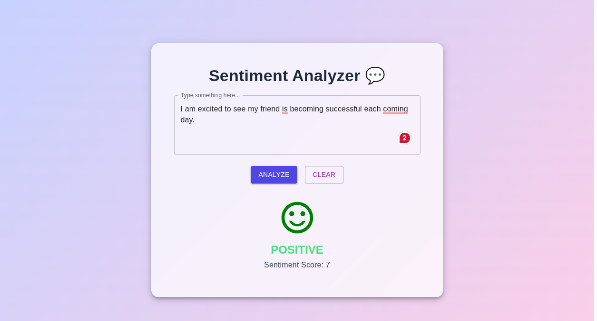
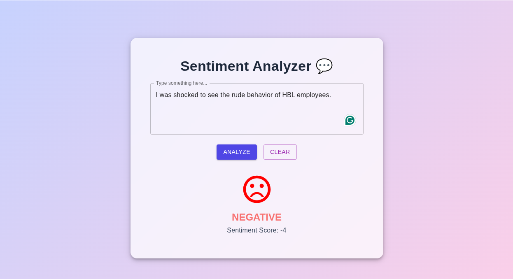

# Sentiment Analyzer 💬

A simple **Sentiment Analysis Web App** built with **React** and **Material UI**, using the **`sentiment` npm package** for completely offline and free sentiment analysis.

---

## 🚀 Features

- Analyze text to determine **Positive, Negative, or Neutral** sentiment
- Shows **sentiment score** along with emoji feedback
- Responsive and interactive UI built with **Material UI**
- Fully **offline** — no API key or external service required
- Easy to deploy on **GitHub Pages / Netlify / Vercel**

---

## 🛠️ Tech Stack

- **Frontend:** React, Material UI  
- **Sentiment Analysis:** [`sentiment`](https://www.npmjs.com/package/sentiment) npm package  
- **Styling:** Material UI components  

---

## 🎨 Screenshots

You can paste your images inside the repo, for example:

